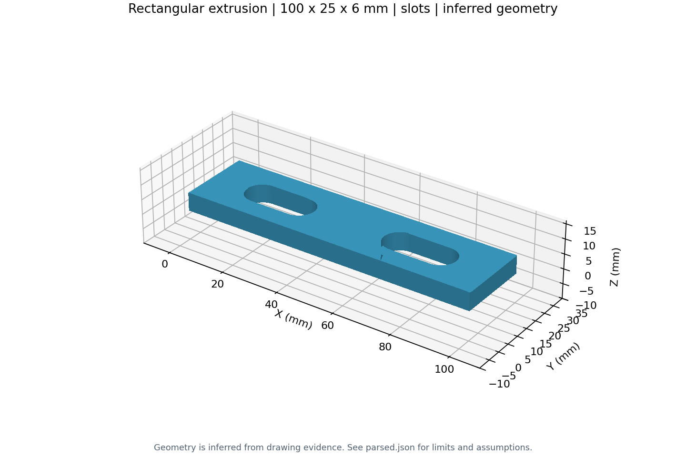
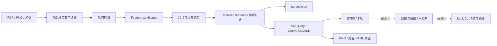

# Drawing2MuJoCo

**从二维工程图提取有证据的几何特征，构建参数化 CAD，并逐步走向机器人仿真。**

当前项目版本 **v0.4.0**。已实现 PDF / PNG / JPG → 几何与尺寸解析 → 证据 JSON → STEP / STL / 3D 预览；同时保留独立运行的 MuJoCo Panda 抓球与轨迹演示。**CAD 零件自动进入 MuJoCo、自动抓取或装配尚未实现。**

尺寸来自图纸，缺失信息明确记录为推断，无法解决的歧义阻止导出。模型成功生成不等于图纸已被完全理解，也不等于满足制造要求。



## 四个开发阶段

| 阶段 | 已验证的链路 | 证明了什么 |
| --- | --- | --- |
| v0.1 · 仿真 | Panda → 抓球 → 搬运与释放 → 轨迹和结果 | MuJoCo 仿真与物理接触可运行 |
| v0.2 · 图纸到 CAD | 二维圆形/同心孔轮廓 → 等截面拉伸 → STEP/STL | 图纸到参数化 CAD 的闭环 |
| v0.3 · 基础几何特征 | 矩形板、圆孔、水平长圆槽、可选锥形沉孔；单圆角轮廓 | 特征候选与尺寸/位置约束分离 |
| v0.4 · 工业 PDF | 原生尺寸、公差、无孔槽板、未标槽几何估算 → CAD | 在有限几何范围内处理真实图纸及缺失信息 |

这是对已有开发阶段的整理。本次 v0.4.0 是首次仓库快照，不伪造早期 Git 提交或历史发布。项目版本与内部 `drawing_cad` / JSON schema 的 `0.1` 分别管理。详见 [版本记录](VERSION_HISTORY.md)。

## 流程



## 成功案例

| 案例 | 结果 | 保留的解释 |
| --- | --- | --- |
| [圆环](examples/washer/README.md) | 外径 8.8、内径 4.4 mm；STEP/STL | 厚度只给出 0.7–0.9 mm，0.8 为 `inferred_midpoint`，不是名义尺寸 |
| [单圆角板件 B2](examples/plate/README.md) | 直线/圆弧外形与定位通孔 | 截图无单位，示例显式传入英寸测试参数 |
| [多孔槽板 B3](examples/plate/README.md) | 多孔、槽、锥形沉孔和位置约束 | 总高 60 与 15+36+15=66 的冲突保留；单位来自毫米测试参数 |
| [工业 PDF 槽板](examples/bracket/README.md) | 100×25×6 mm，两个水平槽，无圆孔 | 槽长宽约 24.83×10.98 mm，位置也由几何估算，confidence=0.55 |
| [Panda 抓球](examples/simulation/README.md) | 抓取、搬运、释放及轨迹 | 独立仿真演示，尚未使用 Drawing2CAD 生成的零件 |

案例中的数值属于输入/验证数据，不用于生产代码匹配零件。JSON 的 `source`、`nominal/min/max`、`confidence`、`evidence`、`conflicts` 与生成配方一起保存。

## Windows / PyCharm 快速开始

### 安装 CAD 环境

安装 **64 位 Python 3.12**，在仓库根目录的 CMD 或 PyCharm Terminal 执行：

```cmd
setup_drawing2cad.cmd
```

脚本建立 `.venv-drawing2cad`，不会更改已有 MuJoCo 环境。也可手动安装：

```cmd
py -3.12 -m venv .venv-drawing2cad
.venv-drawing2cad\Scripts\python.exe -m pip install -r requirements.txt
```

`requirements.txt` 指向 CAD 直接依赖；安装脚本使用完整锁定清单 `requirements-drawing2cad-lock.txt`。

### 运行仓库案例

```cmd
python drawing2cad.py "examples\bracket\input.pdf" --output "outputs\bracket" --open
python drawing2cad.py "examples\washer\input.pdf" --output "outputs\washer" --open
python drawing2cad.py "tests\drawing2cad\fixtures\benchmark3.png" --units mm --output "outputs\plate" --open
```

启动器自动使用 CAD 虚拟环境。PyCharm 运行配置：脚本 `drawing2cad.py`，工作目录为仓库根目录，Parameters 填输入路径和选项；调试时选 `.venv-drawing2cad\Scripts\python.exe`。**只有确认单位后才传 `--units`**，无单位图纸不会默认当作毫米。

### 运行机械臂

继续使用已有 MuJoCo 解释器，或建立独立环境：

```cmd
py -3.12 -m venv .venv-simulation
.venv-simulation\Scripts\python.exe -m pip install -r requirements-simulation.txt
.venv-simulation\Scripts\python.exe pick_and_place.py --headless
```

Panda 需要另行取得完整 Menagerie 模型目录，然后指定路径：

```cmd
python panda_grasp.py --model "D:\models\mujoco_menagerie\franka_emika_panda\scene.xml"
```

本仓库不复制 Menagerie 网格。详情见 [安装说明](docs/INSTALLATION.md)。

## 输出

```text
outputs/my_part/
├── parsed.json          # 图纸、尺寸、约束、置信度、推断和冲突
├── parameters.json      # CAD 配方及尺寸来源
├── model.py             # 可独立重建的 CadQuery 脚本
├── model.step
├── model.stl
├── preview.png
├── preview.html         # 离线交互预览
├── mesh.json
└── evidence.png         # 识别证据叠加图
```

CAD 坐标使用 mm；STL 本身不携带单位。STEP 不包含原生 CAD 软件的特征树，参数化重建由 `model.py` / `parameters.json` 提供。`report.html` 自动报告属于后续计划。

## 验证与边界

当前基线：**112 项 Drawing2CAD 测试通过**，原 B1 图纸 6 项验收通过，本机 MuJoCo 物理测试 4 项通过。详细命令和机器依赖见 [验证记录](docs/VALIDATION.md)。

```cmd
.venv-drawing2cad\Scripts\python.exe -m pytest tests\drawing2cad -q
python -m unittest discover -s tests -p "test_*.py" -v
```

支持限定几何组合：圆盘/同心孔、单圆角板件、水平长圆槽板及同规格孔的可选锥形沉孔。矩形槽板仍要求宽大于高两倍及可唯一配对的正交侧视图。任意曲面、多台阶、盲孔、旋转槽和复杂装配尚不支持。

未标槽估算要求可靠的板尺寸、明确单位、近似一致的 X/Y 绘图比例，并拒绝明确 NOT TO SCALE 的图纸。置信度是启发式证据分数，**不是统计校准的正确率**，不将 0.55 改写成“70%”或“100% 识别准确”。完整限制见 [技术说明](DRAWING2CAD.md)。

## 仓库结构

```text
Drawing2MuJoCo/
├── drawing_cad/         # 现有 CAD pipeline
├── drawing2cad.py
├── panda_grasp.py       # Panda 仿真入口
├── pick_and_place.py    # 简化机械臂入口
├── export_video.py
├── models/
├── schemas/
├── tests/
├── scripts/
├── examples/            # 精选输入、模型、预览和脱敏解析证据
├── docs/                # 安装、架构、验证、路线图
├── outputs/             # 本地结果，默认不提交
└── requirements*.txt
```

保留现有包名与入口，避免整理仓库影响抓取代码；也不创建会遮蔽第三方 `mujoco` 包的同名源码目录。

下一步见 [自动报告与 MuJoCo 接入路线图](docs/ROADMAP.md)。开发约定见 [CONTRIBUTING.md](CONTRIBUTING.md)，图纸和模型来源见 [THIRD_PARTY_NOTICES.md](THIRD_PARTY_NOTICES.md)。仓库按私密方式管理，当前未授予开源许可证。
