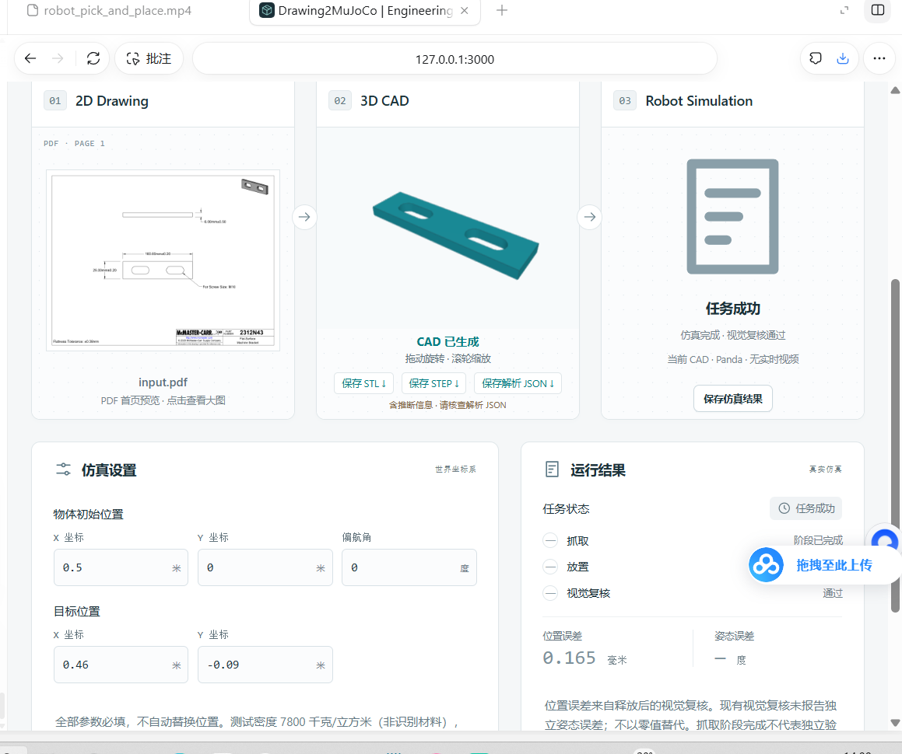
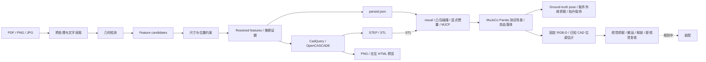
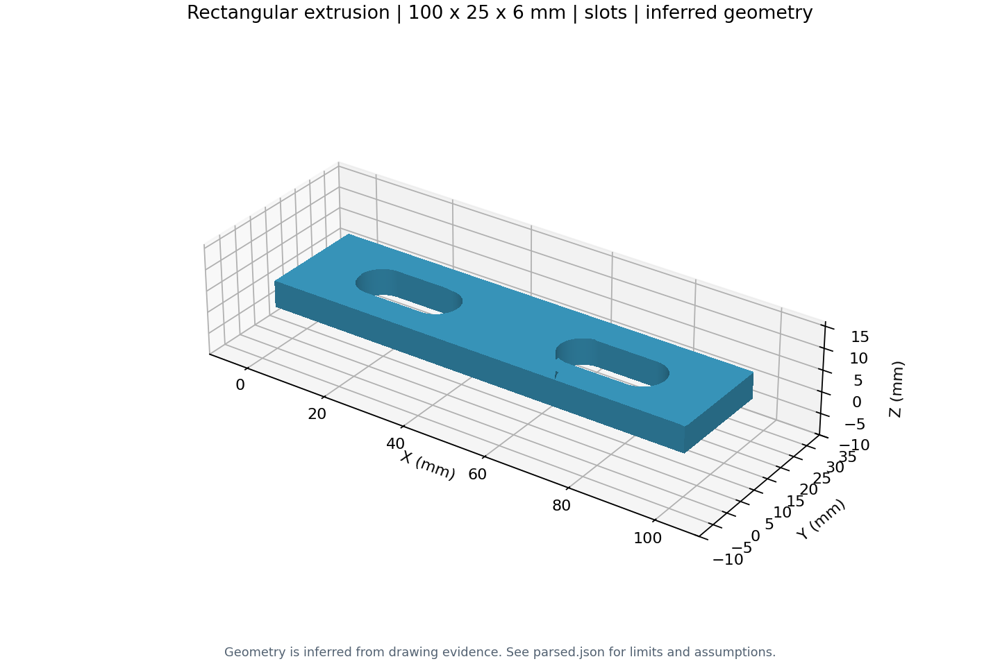
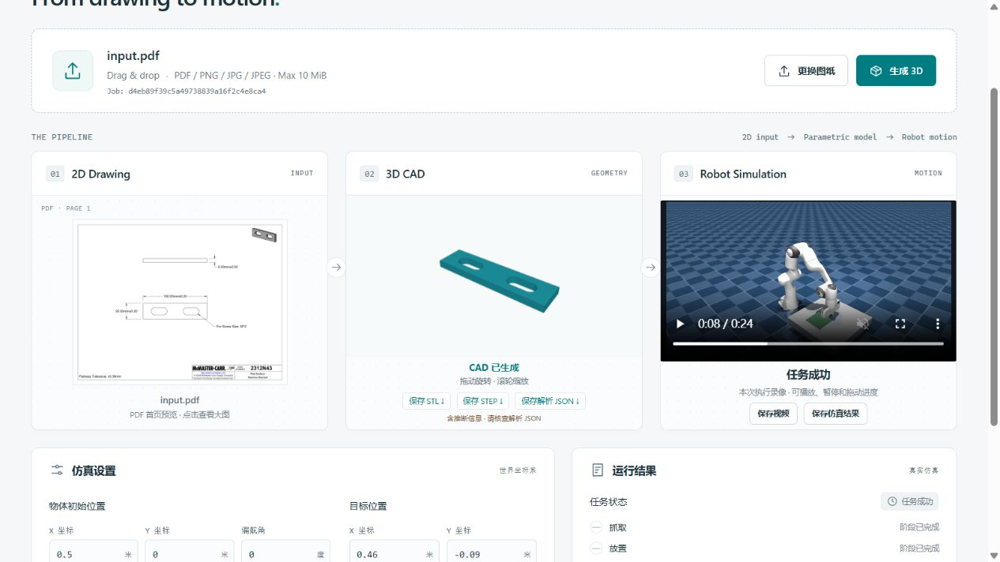

# Drawing2MuJoCo

**从二维工程图提取有证据的几何特征，构建参数化 CAD，并逐步走向机器人仿真。**

已发布快照版本 **v0.4.0**。已实现 PDF / PNG / JPG → 几何与尺寸解析 → 证据 JSON → STEP / STL / 3D 预览；同时保留独立运行的 MuJoCo Panda 抓球与轨迹演示。当前工作区已增加 **STL + parsed.json → MJCF → Panda 桌面落体验证**、板件外缘抓取、RGB-D 位姿估计，以及**视觉抓取 → 搬运放置 → 释放后视觉复核**。能力仍限于已验证的板件和场景范围，不包含 RL、VLM 或装配。

尺寸来自图纸，缺失信息明确记录为推断，无法解决的歧义阻止导出。模型成功生成不等于图纸已被完全理解，也不等于满足制造要求。



以上是本地 **Web 工作台 V0.1**：浏览器内完成"上传图纸 → 生成 3D → 配置并运行 Panda 抓取放置仿真 → 查看视觉复核结果和 MP4 录像"，见 [Web 工作台说明](#web-工作台-v01)。

## 四个开发阶段

| 阶段 | 已验证的链路 | 证明了什么 |
| --- | --- | --- |
| v0.1 · 仿真 | Panda → 抓球 → 搬运与释放 → 轨迹和结果 | MuJoCo 仿真与物理接触可运行 |
| v0.2 · 图纸到 CAD | 二维圆形/同心孔轮廓 → 等截面拉伸 → STEP/STL | 图纸到参数化 CAD 的闭环 |
| v0.3 · 基础几何特征 | 矩形板、圆孔、水平长圆槽、可选锥形沉孔；单圆角轮廓 | 特征候选与尺寸/位置约束分离 |
| v0.4 · 工业 PDF | 原生尺寸、公差、无孔槽板、未标槽几何估算 → CAD | 在有限几何范围内处理真实图纸及缺失信息 |

这是对已有开发阶段的整理。本次 v0.4.0 是首次仓库快照，不伪造早期 Git 提交或历史发布。项目版本与内部 `drawing_cad` / JSON schema 的 `0.1` 分别管理。详见 [版本记录](VERSION_HISTORY.md)。

## 流程


```mermaid
flowchart LR
  A[PDF / PNG / JPG] --> B[预处理与文字读取]
  B --> C[几何检测]
  C --> D[Feature candidates]
  D --> E[尺寸与位置约束]
  E --> F[Resolved features / 推断证据]
  F --> G[parsed.json]
  F --> H[CadQuery / OpenCASCADE]
  H --> I[STEP / STL]
  H --> J[PNG / 交互 HTML 预览]
  I -->|STL| K[visual / 凸包碰撞 / 显式惯量 / MJCF]
  G --> K
  K --> L[MuJoCo Panda 测试场景 / 自由落体]
  L --> M[Ground-truth pose / 板件外缘抓取 / 抬升保持]
  L --> V[固定 RGB-D / 已知 CAD 位姿估计]
  V --> P[视觉抓取 / 搬运 / 释放 / 新视觉复核]
  P -. 规划中 .-> N[装配]
```

## 成功案例



| 案例 | 结果 | 保留的解释 |
| --- | --- | --- |
| [圆环](examples/washer/README.md) | 外径 8.8、内径 4.4 mm；STEP/STL | 厚度只给出 0.7–0.9 mm，0.8 为 `inferred_midpoint`，不是名义尺寸 |
| [单圆角板件 B2](examples/plate/README.md) | 直线/圆弧外形与定位通孔 | 截图无单位，示例显式传入英寸测试参数 |
| [多孔槽板 B3](examples/plate/README.md) | 多孔、槽、锥形沉孔和位置约束 | 总高 60 与 15+36+15=66 的冲突保留；单位来自毫米测试参数 |
| [工业 PDF 槽板](examples/bracket/README.md) | 100×25×6 mm，两个水平槽，无圆孔 | 槽长宽约 24.83×10.98 mm，位置也由几何估算，confidence=0.55 |
| [Panda 抓球](examples/simulation/README.md) | 抓取、搬运、释放及轨迹 | 独立仿真演示，尚未使用 Drawing2CAD 生成的零件 |

案例中的数值属于输入/验证数据，不用于生产代码匹配零件。JSON 的 `source`、`nominal/min/max`、`confidence`、`evidence`、`conflicts` 与生成配方一起保存。

## Web 工作台（V0.1）

`web/` 目录提供一个独立的本地工作台，把上述管线串成一次浏览器内操作：

**上传工程图（PDF/PNG/JPG，≤10 MiB）→ 调用 Drawing2CAD 生成 STEP/STL → Three.js 交互 3D 预览 → 配置物体初始位置与目标区域 → 真实 Panda 视觉抓取放置仿真 → 查看视觉复核结果与同次执行 MP4 录像。**

- **只衔接、不重写**：Web 后端以子进程调用根目录 `drawing2cad.py` 和既有 `cad_mujoco` / `pick_place_task` / `run_embodied_agent` 路径，不新增机器人算法，不修改识别、抓取或验证逻辑。
- **不伪造结果**：任务成功以释放后视觉复核为准；位置误差来自视觉包围盒与目标的实测距离；管线不提供的数据（如姿态误差）显示为"—"而不是零值占位；生成含推断时如实标注 needs_review/assumptions。
- **技术栈**：前端 Next.js（pnpm），后端 FastAPI + 独立虚拟环境；前端经 Next.js 同步转发访问 `/api/*`，不开放 CORS；只绑定 127.0.0.1。
- **边界**：本地单进程同步服务，无云调度、无并发队列、无登录；HTTP 同步等待最长 600 秒。

完整成功状态：仿真执行录像内嵌播放（可暂停/拖动/下载），任务成功以释放后视觉复核判定，本次执行轨迹与结果 JSON 均可保存。



快速启动（两个终端）：

```powershell
# 终端一：前端（首次先 pnpm install --frozen-lockfile）
cd web\frontend
pnpm dev          # http://127.0.0.1:3000

# 终端二：后端（首次先建立 .venv 并安装 requirements-dev.txt）
cd web\backend
.\.venv\Scripts\python.exe -m uvicorn app.main:app --host 127.0.0.1 --port 8000
```

上传/生成/仿真三个接口的请求与响应格式、存储结构、错误码、录像管线及 87+ 项测试说明，见 [web/README.md](web/README.md)。

## Windows / PyCharm 快速开始

### 安装 CAD 环境

安装 **64 位 Python 3.12**，在仓库根目录的 CMD 或 PyCharm Terminal 执行：

```cmd
setup_drawing2cad.cmd
```

脚本建立 `.venv-drawing2cad`，不会更改已有 MuJoCo 环境。也可手动安装：

```cmd
py -3.12 -m venv .venv-drawing2cad
.venv-drawing2cad\Scripts\python.exe -m pip install -r requirements.txt
```

`requirements.txt` 指向 CAD 直接依赖；安装脚本使用完整锁定清单 `requirements-drawing2cad-lock.txt`。

### 运行仓库案例

```cmd
python drawing2cad.py "examples\bracket\input.pdf" --output "outputs\bracket" --open
python drawing2cad.py "examples\washer\input.pdf" --output "outputs\washer" --open
python drawing2cad.py "tests\drawing2cad\fixtures\benchmark3.png" --units mm --output "outputs\plate" --open
```

启动器自动使用 CAD 虚拟环境。PyCharm 运行配置：脚本 `drawing2cad.py`，工作目录为仓库根目录，Parameters 填输入路径和选项；调试时选 `.venv-drawing2cad\Scripts\python.exe`。**只有确认单位后才传 `--units`**，无单位图纸不会默认当作毫米。

### 运行机械臂

继续使用已有 MuJoCo 解释器，或建立独立环境：

```cmd
py -3.12 -m venv .venv-simulation
.venv-simulation\Scripts\python.exe -m pip install -r requirements-simulation.txt
.venv-simulation\Scripts\python.exe pick_and_place.py --headless
```

Panda 需要另行取得完整 Menagerie 模型目录，然后指定路径：

```cmd
python panda_grasp.py --model "D:\models\mujoco_menagerie\franka_emika_panda\scene.xml"
```

本仓库不复制 Menagerie 网格。详情见 [安装说明](docs/INSTALLATION.md)。

## 输出

独立的 CAD→MuJoCo 转换入口是 `cad2mujoco.py`，使用 MuJoCo 解释器，并要求显式质量或密度。它不修改 Drawing2CAD 识别或现有抓球行为。运行命令、MJCF 结构、单位/惯量来源与凸包碰撞限制见 [CAD→MuJoCo 说明](docs/CAD_TO_MUJOCO.md)。

独立抓取入口是 `manipulate_cad.py`，输入含 Panda 的 CAD2MuJoCo `scene.xml`，输出候选、真实物体轨迹、接触与成功/失败记录。运行方式和 IK、夹爪配置、几何及稳定性边界见 [Manipulation 说明](docs/MANIPULATION.md)。

新增独立 RGB-D 感知适配层：`manipulate_cad.py ... --pose-source vision` 从固定相机 depth/segmentation 与已知 CAD 估计位姿；默认 `--pose-source ground_truth` 保留原行为。视觉感知失败不回退真值。观察时机、对称歧义、误差和运行方式见 [Perception 说明](docs/PERCEPTION.md)。

独立搬运放置入口：`place_cad.py scene.xml --target-xy X Y --zone-size WIDTH HEIGHT`，目标区域使用世界米制坐标。释放撤离后重新采集多帧 RGB-D，以视觉结果判断成功，真值仅用于最终离线评估。见 [Pick-and-Place 说明](docs/PICK_AND_PLACE.md)。

新增独立确定性 Agent：`run_embodied_agent.py scene.xml --plan examples/agent/task_plan.json --output outputs/embodied_agent/panda_cad`。按结构化 TaskPlan 调用 `observe → locate → pick → place → verify`，复用同一次原有仿真；失败返回结构化错误并停止后续步骤。Agent 不接触关节或目标真值，不接 LLM/VLM。API、schema、运行方法及阶段完成与任务成功的区别见 [Robot Skills 说明](docs/EMBODIED_AGENT.md)。

独立语言规划入口：`plan_instruction.py "把板件放到装配区" --catalog examples/agent/allowed_catalog.json --output outputs/language_planner/assembly`。默认离线解析，只生成经现有 schema、目录允许列表及计划契约校验的 pending TaskPlan，不执行机器人。提供独立 LLM callable adapter；未知/歧义指令和非法模型输出明确失败。见 [Language Planner 说明](docs/LANGUAGE_PLANNER.md)。

```text
outputs/my_part/
├── parsed.json          # 图纸、尺寸、约束、置信度、推断和冲突
├── parameters.json      # CAD 配方及尺寸来源
├── model.py             # 可独立重建的 CadQuery 脚本
├── model.step
├── model.stl
├── preview.png
├── preview.html         # 离线交互预览
├── mesh.json
└── evidence.png         # 识别证据叠加图
```

CAD 坐标使用 mm；STL 本身不携带单位。STEP 不包含原生 CAD 软件的特征树，参数化重建由 `model.py` / `parameters.json` 提供。`report.html` 自动报告属于后续计划。

## 验证与边界

发布前使用统一入口，覆盖所有模块、原抓球、B1/B2/B3 和从新工程图开始的 E2E；检查预期测试数量，任何 skip/xfail/error 都不能作为发布通过。历史分模块记录见 [验证记录](docs/VALIDATION.md)，当前入口及字段语义见 [完整验证](docs/FULL_VALIDATION.md)。

```cmd
set CAD_MUJOCO_PANDA_SCENE=C:\path\to\mujoco_menagerie\franka_emika_panda\scene.xml
python full_validation.py --cad-python .venv-drawing2cad\Scripts\python.exe
```

结果写入 `outputs/full_validation/<timestamp>/validation.json`。`test_gate_success` 与发布 `success` 分开：perception fixture 的独立 drop failure 仍是 blocker，即使感知/抓取测试通过也不会报告发布成功。仅在根目录执行 unittest discover 不会覆盖各子目录测试。

支持限定几何组合：圆盘/同心孔、单圆角板件、水平长圆槽板及同规格孔的可选锥形沉孔。矩形槽板仍要求宽大于高两倍及可唯一配对的正交侧视图。任意曲面、多台阶、盲孔、旋转槽和复杂装配尚不支持。

未标槽估算要求可靠的板尺寸、明确单位、近似一致的 X/Y 绘图比例，并拒绝明确 NOT TO SCALE 的图纸。置信度是启发式证据分数，**不是统计校准的正确率**，不将 0.55 改写成“70%”或“100% 识别准确”。完整限制见 [技术说明](DRAWING2CAD.md)。

## 仓库结构

```text
Drawing2MuJoCo/
├── drawing_cad/         # 现有 CAD pipeline
├── drawing2cad.py
├── cad_mujoco/          # 独立的 STL/证据 → 刚体 MJCF、场景拼接和落体验证
├── cad2mujoco.py
├── manipulation/       # 实时位姿、外缘候选、Panda IK 与物理抓取验证
├── perception/         # RGB-D、点云/CAD 配准、视觉适配与离线误差评估
├── pick_place_task/    # 独立搬运、释放、撤离和新视觉任务判定
├── place_cad.py
├── embodied_agent/     # TaskPlan、robot skills、原任务阶段适配与失败传播
├── run_embodied_agent.py
├── language_planner/   # 自然语言、provider adapter、目录/schema 校验；仅规划
├── plan_instruction.py
├── manipulate_cad.py
├── panda_grasp.py       # Panda 仿真入口
├── pick_and_place.py    # 简化机械臂入口
├── export_video.py
├── models/
├── schemas/
├── tests/
├── scripts/
├── examples/            # 精选输入、模型、预览和脱敏解析证据
├── docs/                # 安装、架构、验证、路线图
├── web/                 # 本地 Web 工作台：Next.js 前端 + FastAPI 后端（见 web/README.md）
├── outputs/             # 本地结果，默认不提交
└── requirements*.txt
```

保留现有包名与入口，避免整理仓库影响抓取代码；也不创建会遮蔽第三方 `mujoco` 包的同名源码目录。

下一步见 [自动报告与 MuJoCo 接入路线图](docs/ROADMAP.md)。开发约定见 [CONTRIBUTING.md](CONTRIBUTING.md)，图纸和模型来源见 [THIRD_PARTY_NOTICES.md](THIRD_PARTY_NOTICES.md)。仓库按私密方式管理，当前未授予开源许可证。
