# 独立视觉 Pick-and-Place task

`place_cad.py` / `pick_place_task/` 消费 CAD2MuJoCo 的 Panda 场景，复用现有 RGB-D 配准、外缘候选、Panda IK 和位置伺服。既有 `drawing_cad/`、`cad_mujoco/`、`manipulation/`、`perception/`、抓球入口及测试不修改。新任务没有 ground-truth 模式，也没有感知失败 fallback。

## Windows / PyCharm

使用现有 MuJoCo Python 环境；依赖与上一阶段相同，需要时运行 `python -m pip install -r requirements-perception.txt`。

```cmd
python place_cad.py outputs\cad2mujoco\panda_bracket\scene.xml --target-xy 0.46 -0.09 --zone-size 0.15 0.10 --output outputs\pick_place\panda_cad
```

`--target-xy` 是世界坐标中的目标区域中心，`--zone-size` 是区域沿世界 X/Y 的完整宽度，全部使用米，均须显式提供。上面的数字仅是一个运行示例；生产实现不匹配零件名、输入文件名、尺寸或测试位置。

PyCharm 中选择脚本 `place_cad.py`，Parameters 填上述 scene 路径和选项，Working directory 设为项目根目录，解释器选已安装 MuJoCo 的 Python。默认离屏执行，无交互动画窗口。输出 `result.json`、RGB-D 帧和可回放轨迹；失败退出码为 1，明确记录失败阶段。

## 状态机

```mermaid
flowchart LR
  S[settle] --> O[observe / 两次 RGB-D]
  O --> P[全路径候选检查]
  P --> A[approach / grasp]
  A --> C[close]
  C --> L[lift]
  L --> M[move / pre-place]
  M --> D[place]
  D --> R[release]
  R --> T[retreat / clear view]
  T --> V[重新采集 4 帧 / visual verify]
  V --> E[固定任务成功或失败]
  E --> G[离线真值评估 / 不改变判定]
```



起始等待后取两次视觉位姿，检查位置稳定且物体底面接近桌面。用最新视觉位姿生成原有外缘候选，并提前检查候选的 approach、grasp、lift、transfer 和 place；某候选在目标位置不可达时，继续尝试其余已有候选。不改变 IK 门限，也不通过换成真值位姿重试。

若起点已在目标中心容限内，任务明确拒绝，避免把“原地物体未被搬运”算成演示成功。抓取后使用初始视觉位姿与机器人 TCP 编码器建立相对变换，夹持过程中据此预测物体位姿。该变换只是规划信念，**不是 weld、mocap、约束或物理状态写入**。

## 目标区与放置规划

`scene.py` 在新场景副本中增加 `target_zone` site，仅作可视标记，没有碰撞和质量。区域须完整位于已标定的水平桌面范围内。原 XML 不变。

`planning.py` 根据实际 CAD 顶点、初始视觉朝向和目标区域计算放置姿态：保持观测到的朝向，使世界坐标外包络中心对准目标 XY，底面位于桌面上方 `release_gap_m`（默认 1.5 mm）。物体整个投影必须位于目标区内，默认再保留 2 mm 边距；区域过小明确失败。

设世界物体位姿为 `T_WO`，机器人 TCP 为 `T_WT`，抓取时估计 `T_TO = inverse(T_WT) × T_WO`。放置 TCP 为 `T_WT_place = T_WO_place × inverse(T_TO)`。保留当前姿态，先升至安全高度，水平移动到 pre-place，再垂直下降。默认安全余量 120 mm；值是公开配置的机器人动作参数，不是零件尺寸或位置答案。

原 IK 在独立 scratch world 内逐段采样检查机器人和预测夹持物体的碰撞。进入搬运阶段后按实测机器人 TCP 更新夹持变换并再次检查路径。该规划为有限采样检查，不是连续碰撞保证或全局路径规划。

在近桌面高度张开夹爪，由重力和接触完成落座。通过夹爪自身关节编码器确认已打开；随后先向上撤离，再返回本轮开始时保存的机器人 TCP 位姿，以清空相机视线。没有用物体真值计算撤离路径。

## 新视觉观测与成功判定

撤离后每隔 0.4 s 重新调用现有 perception，采集 4 帧，首末帧间隔至少 1.2 s。复核直接消费新 `Estimate`，不消费归档 qpos 或期望落点作为观测。每帧均保存采集时间，旧帧、重复时间及感知失败不能算成功。

同时要求：

- 全部新帧有效，且晚于 release/retreat。
- 整个 CAD 外包络位于 target_zone 内，并保留设定边距。
- 外包络中心距目标中心不超过 10 mm。
- 视觉估计底面距桌面不超过 2.5 mm。
- 多帧中心漂移不超过 1.5 mm，外包络漂移不超过 3 mm。
- 夹爪已经打开、机器人已经撤离，且物体相对初始视觉位置确实发生移动。

阈值在 `TaskConfig` 明确公开；这些是任务验收容限，不是测量精度承诺。对称朝向可能跳到等价表示，因此稳定性比较外包络及中心，不把等价四元数翻转误认为运动。唯一朝向恢复不属于本轮范围。

成功判定先固定，之后才调用 `evaluation.py`，从此前仅归档的仿真状态解码物体位姿，计算感知误差、真实落点误差、抬升高度和验证窗口内稳定性。`offline_evaluation.used_for_task_success=false`；物体即便实际已放对，只要视觉复核失败，任务仍失败。

运行时保留原机器人碰撞及数值保护，但它们不提供抓取或放置 pose，也不替代视觉任务判定。没有调用原 manipulation 的真值抓取成功检查。

## 文件与证据

新增模块：`planning.py`（变换和区域）、`scene.py`（目标标记）、`pipeline.py`（任务状态机）、`verification.py`（纯视觉判定）、`evaluation.py`（离线误差）。新增入口 `place_cad.py`、独立 `tests/pick_place_task/`；不增加第三方依赖。

```text
result/
├── task_scene.xml + scene_assets/
├── result.json
├── observations.json
├── candidates.json
├── trace.json
├── trajectory.npz
├── capture_initial_0.png / capture_initial_1.png
├── capture_verify_0.png ... capture_verify_3.png
└── 每次采集对应的 depth.npy / segmentation.npy / camera.json / points.npz
```

本任务默认相机 1440×1080，其余标定沿用已有固定 RGB-D 安装。初次以原 960×720 设置运行时，某目标位置的薄板短边受像素量化影响，未通过原 perception 的 5% 尺寸一致性门限。新任务提高分辨率后通过，**未修改 perception 的门限或识别逻辑**。可以通过 Python API 的 `CameraConfig` 显式配置相机；不保证任意远距离、小目标或遮挡都可识别。

## 验证

```cmd
set CAD_MUJOCO_PANDA_SCENE=C:\Users\86155\Desktop\mujoco_menagerie\franka_emika_panda\scene.xml
set PICK_PLACE_TEST_REPORT=outputs\pick_place_dev\tests_final.json
python -m unittest discover -s tests\pick_place_task -v
```

物理案例包含：已有 CAD 槽板；同时变化的初始 XY、yaw 与目标 XY；84×36×10 mm 和 128×54×12 mm 合成板。尺寸仅存在于测试输入。另有初始分割失败、释放后分割失败、实际搬往错误区域、越出桌面的目标及未知物体反例；纯函数测试覆盖随机几何/变换、区域过小、陈旧帧、移动/悬空/未释放物体等。

物理测试逐个 `mj_step` 检查目标 qpos/qvel 在步骤间未被改写、目标未被施加外力、模型无 weld；原 GT observer 和接触成功检查均被替换为抛异常函数。既有全部回归单独运行，结果和数值见 [pick_place_verification.json](validation/pick_place_verification.json) 及 [验证汇总](VALIDATION.md)。

本机最终结果：新增 18 项通过，原有 156 项回归及 B1 的 6 项验收通过。最终补充的未知目标 CLI 错误路径也单独重测通过。受保护的 60 个已有源码和测试文件 SHA-256 全部一致。

| 正常物理案例 | 视觉估计中心距目标 / mm | 离线真实中心距目标 / mm |
| --- | ---: | ---: |
| 已有 CAD 槽板 | 0.165 | 0.026 |
| 槽板改变起始 XY、34° yaw、目标 XY | 0.054 | 0.055 |
| 槽板 -49° yaw、另一目标 | 0.064 | 0.064 |
| 84×36×10 mm 板、-27° yaw | 0.038 | 0.035 |
| 128×54×12 mm 板、72° yaw | 0.106 | 0.108 |

这 5 个预定正常案例成功率 5/5；不是未知场景成功率估计。复核阶段感知位姿对真值的位置误差最大 0.169 mm；4 帧首末间隔 1.2 s，离线观测窗口内中心漂移最大约 0.0051 mm，所有正例先抬离桌面超过 100 mm。误差来自理想仿真 RGB-D，不能外推真实传感器精度。

错误落点反例的视觉中心误差约 168 mm，被区域及中心检查拒绝。释放后分割被屏蔽的反例虽然离线评估显示实际已经放对，任务仍因新感知失败而失败。首次开发中的低分辨率复核失败与运输 IK 失败也保留在验证记录中；最终路径检查延续抓取 IK seed，并检查完整任务候选。

## 剩余限制

第一版限单个已知 CAD 的近水平矩形薄板、已标定水平桌面和可见外轮廓；沿用 MuJoCo 实例分割与理想深度。物体在夹持期间假定相对夹爪不滑动，没有运输中的视觉纠偏或自动重抓。回到初始机器人位姿仍无法看清目标时明确失败，不使用真值补全。

保持初始 yaw，不做目标朝向重定向；对称零件不能保证唯一的 CAD 朝向。目标区接触仍来自 CAD2MuJoCo 的凸包碰撞，孔槽不能用于插入或装配。未实现 VLM、RL、未知物体检测、真实相机噪声处理、全局避障或力控装配。有限测试通过率仅描述当前测试集；多帧稳定仅覆盖观测时间窗口。
