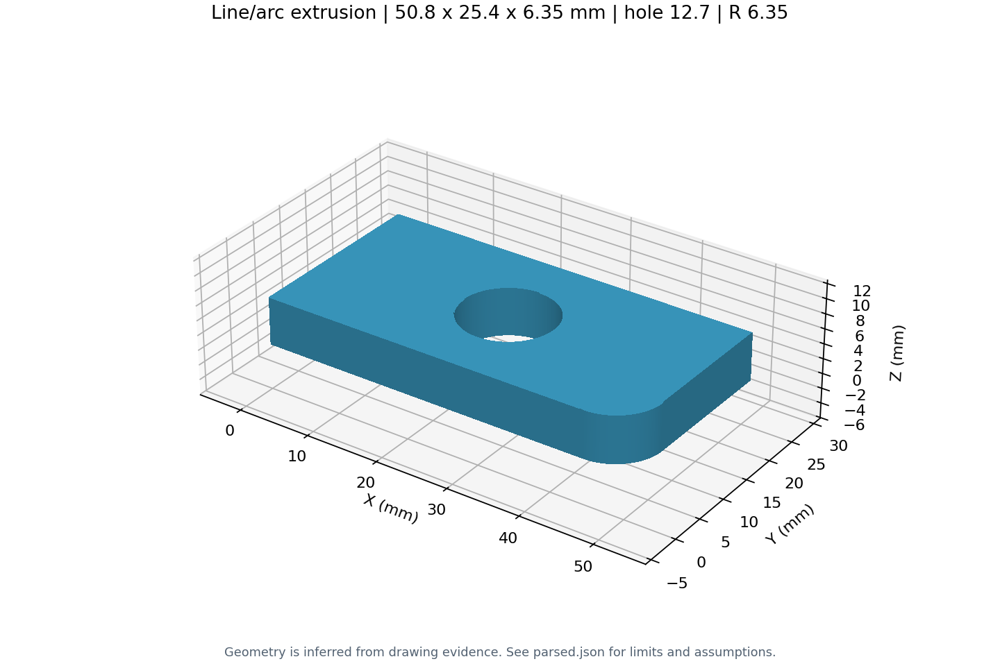
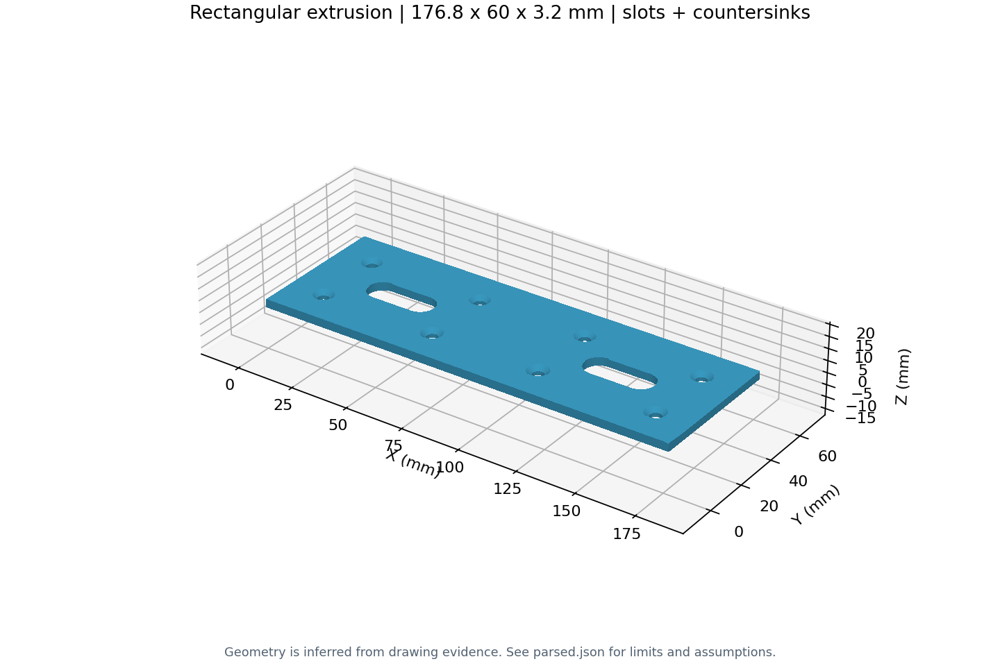

# 板件：轮廓、孔、槽与沉孔

## B2：单圆角与通孔

原输入位于 `tests/drawing2cad/fixtures/benchmark2.png`，结果在 `b2/`。截图没有单位；本案例显式使用英寸测试参数，不宣称单位由图纸识别。

```cmd
python drawing2cad.py "tests\drawing2cad\fixtures\benchmark2.png" --units in --output "outputs\b2"
```



## B3：多孔、多槽与锥形沉孔

原输入位于 `tests/drawing2cad/fixtures/benchmark3.png`，结果在 `b3/`。截图没有单位；本案例传入毫米测试参数。

```cmd
python drawing2cad.py "tests\drawing2cad\fixtures\benchmark3.png" --units mm --output "outputs\b3"
```

外形采用直接总高 60，尺寸链 15+36+15=66 记录为 conflict。受影响孔位通过检测几何区分候选时，保留推断标记、低置信度和全部候选；不判定哪个原始尺寸错误。两个槽和八个孔是本例的检测结果，不是生产代码固定数量。


