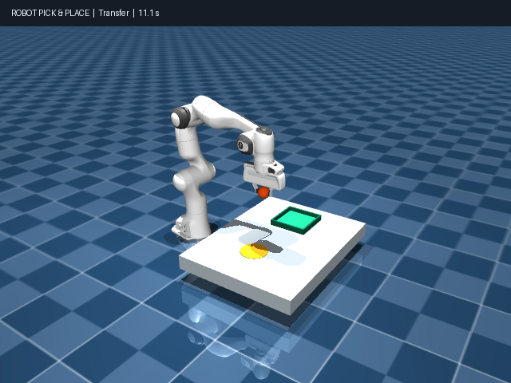
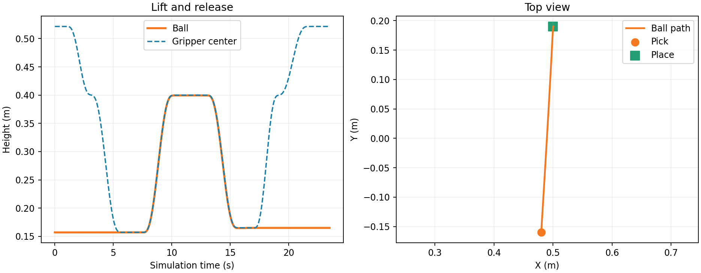

# Panda 抓球与轨迹

现有 Panda 演示使用 Menagerie 模型，完成靠近、下降、夹紧、搬运、释放与归位。球由 MuJoCo 接触与摩擦推进，不通过焊接约束搬运。演示启用理想机器人重力补偿，并调整指垫接触摩擦。

```cmd
python panda_grasp.py --model "D:\models\mujoco_menagerie\franka_emika_panda\scene.xml" --headless
python pick_and_place.py --headless
```

`preview.png`、`trajectory.png` 和 `result.json` 是已有成功运行记录。该场景尚未接入 Drawing2CAD 输出零件。




