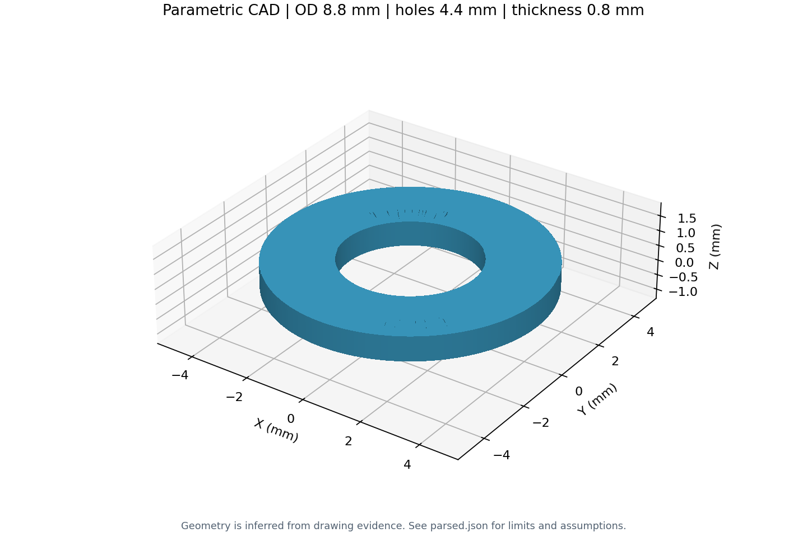

# 圆环：上下限尺寸语义

输入 `input.pdf`；精选结果在 `result/`。

识别外径 8.8 mm、内径 4.4 mm。厚度标注只给出 0.7–0.9 mm，建模使用中值 0.8 mm，记录 `nominal=null`、`inferred=true`、`value_source=inferred_midpoint`。该中值不是图纸明确名义尺寸。

```cmd
python drawing2cad.py "examples\washer\input.pdf" --output "outputs\washer"
```

使用 `--limit-policy require-nominal` 会保存 JSON 并停止导出。来源见 [第三方说明](../../THIRD_PARTY_NOTICES.md)。


